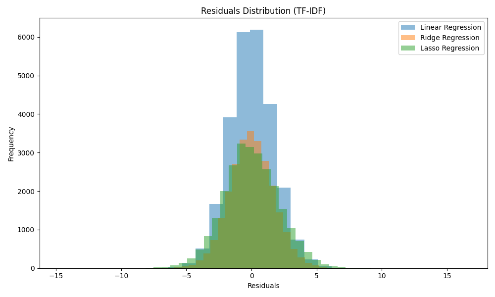
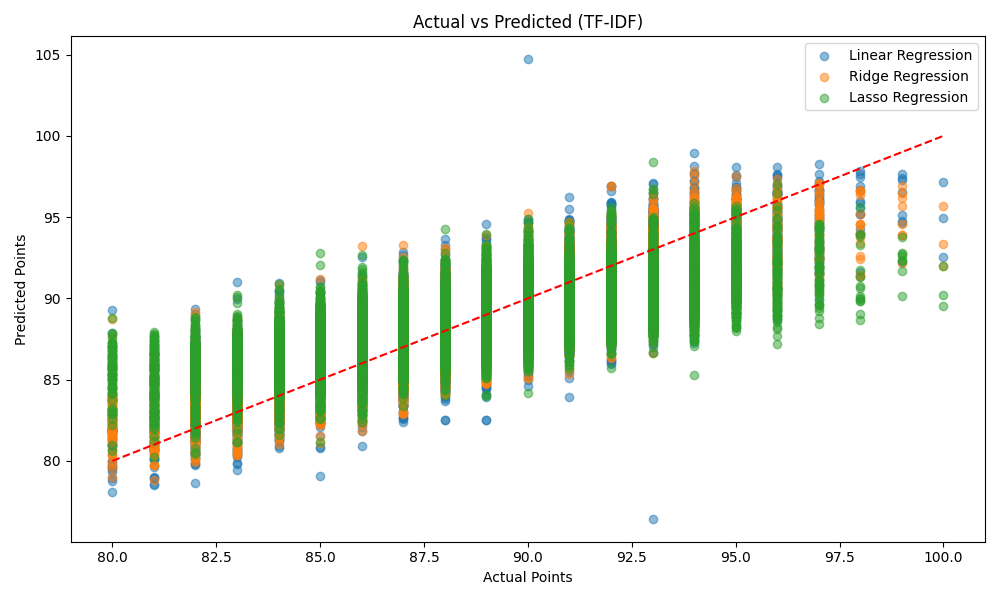

This is a project I did in college where I tried to predict wine ratings based on the description given by the review using NLP. I explain my methodology below. 

## Methods 
#### Natural Language Processing
NLP , or Natural Language processing is a broad scope
term used to refer to the process and understanding of
text in computer analysis.
#### Techniques often include
sentiment analysis, text classification, tokenization, and
feature extraction. In this paper, NLP will be used to
predict wine review scores based on the description
given in the review of the wine. These are innately
correlated, as they are often written by the same people,
but illustrating this can be informative.
#### Feature Extraction
Feature extraction is the process in which data is
extracted from the text for NLP . Often, text goes
through a preprocessing routine that allows us to filter
out noisy, useless data. In this case, we used Term
Frequency (TF) and Term Frequency Inverse
Document Frequency (TF-IDF) to extract features.
These methods count the frequency of words and then
score & vectorize them to give data.

#### Dataset Collection
This data was taken from a Kaggle competition titled
‘Wine Reviews’, collected by a user named
“ZackThoutt”. He aggregated over 150,000 wine
reviews into an accessible file that was analyzed here.
This data contains many different statistics, but for this
project the scope will be limited to the “description”, a
brief 20-30 word summary of the wine, and the
“score”, an aggregate rating from thousands of
reviews.

#### Text PreProcessing
To process text, I used the Python Natural Language
toolkit (nltk). This allowed me to tokenize the process
where we break down words into individual strings,
remove punctuations, and remove casing. This also
removed certain stopwords, which are defined as
words in the English language that have no concrete
meaning. This gives us more consistent data to work
with, and allows for more accurate training of models
without needless noise.
#### Parameters Tuning & Regression 
With the data processed, it was time to construct a
model that would accurately predict scores based on
reviews. The four models chosen were Linear
Regression (LR), Ridge Regression, Lasso Regression,
and svr. Linear regression gives a standard analysis
and formal Linear Regression predicts the target
variable by fitting a linear relationship between the
independent variables and the dependent variable. It
assumes that the relationship between the input
features and the target is linear. Ridge regression adds
a penalty to the loss function that constrains the
magnitude of the coefficients. This helps to prevent
overfitting and is particularly useful when dealing with
multicollinearity among features. Lasso regression also
adds a regularization term to the Linear Regression
model, but it uses L1 regularization, which can shrink
some coefficients to zero. This allows Lasso to
perform feature selection by identifying and excluding
less important features

##RESULTS 
#### Evaluation of Analysis 
To evaluate my models, I conducted standardized
statistical tests such as MSE and R-squared. Below
are graphs of the MSE and R-squared values for these
experiments.
In these graphs, we can see a picture of the statistical
nature of our models, for both TF and TF-IDF. The
R-squared tests show that the models can explain
between 60 and 70 percent of the variation of the
score. The most effective model according to the linear
regression is the ridge regression, for both TF and
TF-IDF, but the linear regression is close behind. The
mean squared error simply tells the average error in
the predicted values. These numbers are fairly high,
but the score is evaluated on a 0 to 100 scale, meaning
that there should be a great deal of variance. An
average of 3% error on a 100 point scale is not super
significant.
#### Most Significant Word Coefficients 
With ridge established as the most generally effective
model, it can be used to draw more insights into the
text. The effectiveness of individual words can be
found and isolated

This graph of the residuals distribution shows that the
residuals are generally centered around zero,
indicating that the model has done a decent job at
plotting the data. Given the natural shape of their
distributions, we can see that Ridge and Lasso
regressions are quite effective here. While the linear
regression performed well with regards to MSE and
R-squared, it fails here. The spread and height of the
residuals show that this model has a good deal of
variance. The higher concentration of residuals means
that these models are more robust to outliers.

This graph shows the actual values plotted against the
predicted ones. The trend line maps the “accuracy” of
the three models. In analyzing this data, it was found
that for linear regression 77% of the predictions were
within 2 percentage points of the actual value, for
ridge it was also 77%, and for Lasso it was 69%.
These are averages of the TF and TF-IDF outputs.
This graph and data paints a picture of these models as
generally successful ones, but not super accurate. For
parameter tuning, the most effective alphas were 10.0
for TF-ridge, 0.001 for TF-lasso, 1.0 for TF-IDF-ridge,
and .001 for TF-idf-lasso.
Above, there are 4 graphs that plot the top and bottom
ten words for both TF and TF-IDF modeling. These
words give general red flags to wine consumers, and
indicate that people should stay away from ultra sweet
wines from Virginia, but seek out concentrated flavors. \v

## Conclusion  
There wasn't much novel insight to be drawn from the results themselves -- it mostly just showed that clearly negative words like "rotten" or "skunky" led to bad scores.  However, this meant that constructing the models was an informative process. 
In building these models, the hardest question was to
choose which parameters. With such a large dataset, it
was easy to be distracted by the appeal of adding more
and more. However, I found that as I added more
parameters such as price, location, and name, or more
models such as svm, random forest, or decision trees, I
sacrificed both performance and accuracy. The most
effective increases in accuracy and statistical
correlation I found came from text preprocessing. I
had struggled to build an effective model, but when
tokenization was introduced, it changed the model.
In conclusion, Wines are often obscured by foreign
languages and hefty price tags, but the appeal of wine
can still be accessed by the average consumer. If one
is able to give a brief description of the wine, that can
be related to the quality of the wine as rated by the
general public.

